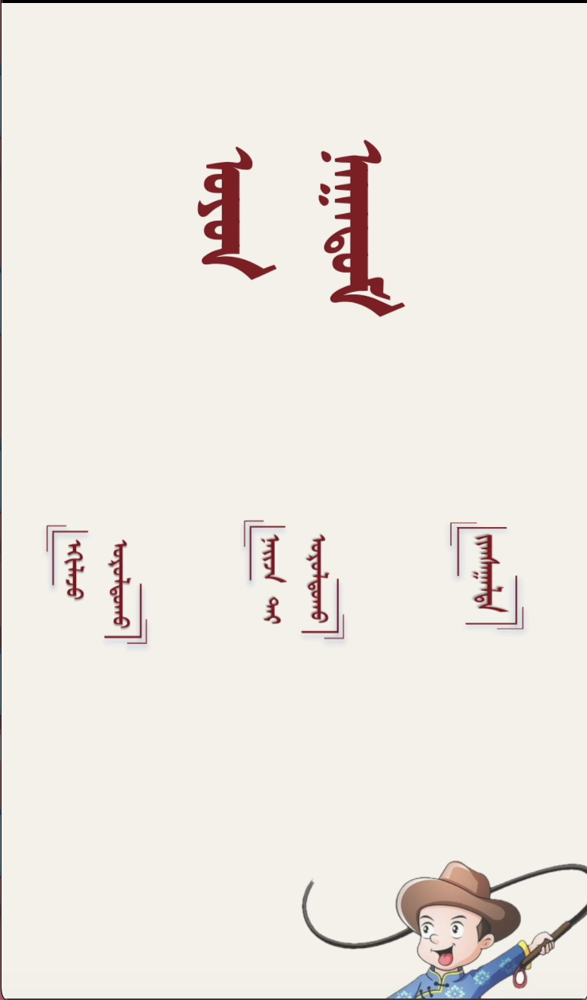
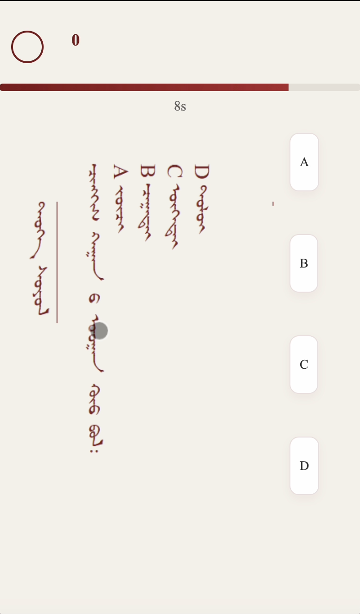
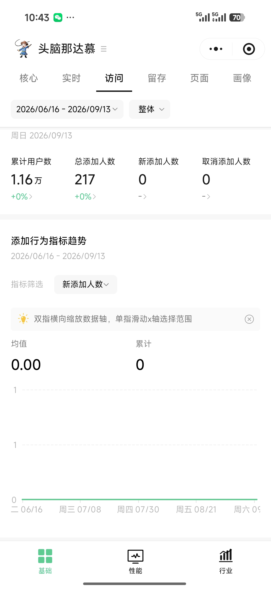

# 头脑那达慕

一款以蒙古文学习与文化知识为主题的微信答题小程序。项目将限时答题、好友对战和排行榜结合起来，让用户在轻量游戏中练习蒙古文、检验知识掌握情况，并与朋友一较高下。

<p align="center">
  
</p>

## 项目亮点

- **限时单人答题**：每题 20 秒倒计时，实时记录答题结果与分数。
- **双人房间对战**：支持创建房间、邀请好友、准备开局、同步答题和胜负结算。
- **排行榜**：记录个人最佳成绩，展示 Top 100，并标注当前用户的真实排名。
- **用户资料**：支持设置昵称和头像，用于排行榜及好友对战展示。
- **沉浸式体验**：采用蒙古文视觉元素，配有背景音乐、点击音效和结果海报。
- **微信云开发**：使用云函数、云数据库和云存储承载登录、题库、成绩及房间状态。

## 项目展示

### 答题页面

题目以图片形式呈现，用户需要在倒计时结束前从 A、B、C、D 四个选项中作答。

<p align="center">
  
</p>

### 用户数据

小程序已在真实场景中投入使用。截至截图所示统计周期，累计用户数约为 **1.16 万**。

<p align="center">
  
</p>

## 技术栈

- 微信小程序原生框架：WXML、WXSS、JavaScript
- 微信云开发：云函数、云数据库、云存储
- `wx-server-sdk`：云函数服务端能力

## 目录结构

```text
.
├── miniprogram/
│   ├── pages/index/          # 首页与功能入口
│   ├── game/
│   │   ├── single/           # 单人答题
│   │   ├── room/             # 双人房间
│   │   ├── battle/           # 实时对战
│   │   └── result/           # 成绩、对战结算与资料编辑
│   ├── rankpkg/rank/         # 排行榜分包
│   └── utils/                # 对战题库等公共数据
├── cloudfunctions/           # 登录、房间、对战、成绩等云函数
├── docs/images/              # README 展示图片
└── project.config.json       # 微信开发者工具项目配置
```

## 本地运行

1. 克隆仓库：

   ```bash
   git clone https://github.com/CYLY20061229/MongolianNaadam.git
   ```

2. 使用微信开发者工具导入项目根目录。
3. 开通微信云开发，并将 `miniprogram/app.js` 中的云环境 ID 替换为自己的环境 ID。
4. 在云数据库中创建 `users` 和 `rooms` 集合，并根据业务需要配置访问权限。
5. 在微信开发者工具中依次上传并部署 `cloudfunctions/` 下的云函数（选择“云端安装依赖”）。
6. 将题目图片、界面图片及音频上传到云存储，并同步修改代码中的 `cloud://` 文件地址。
7. 编译运行小程序。

## 云函数

| 云函数 | 作用 |
| --- | --- |
| `login` | 获取用户 OpenID |
| `createRoom` / `joinRoom` | 创建或加入双人房间 |
| `updateReady` / `updatePlayerProfile` | 同步准备状态与玩家资料 |
| `startGame` | 初始化题目并开始对战 |
| `submitBattleAnswer` | 提交对战答案并推进比赛状态 |
| `submitScore` | 保存个人成绩与最佳分数 |
| `getLeaderboard` | 获取排行榜数据 |

## 说明

项目中的部分题目图片、界面素材和音频存放于原云开发环境。自行部署时，请准备对应资源并更新云存储路径。
